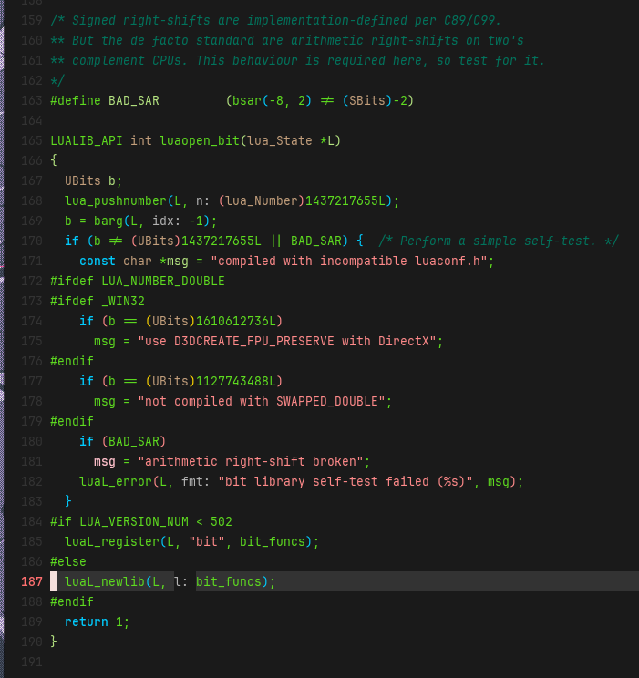

# Neon Green Theme for Emacs

## Description
Neon Green is a vibrant green theme for Emacs, designed to be easy on the eyes. It provides a variety of colors for different elements to enhance readability and improve the overall coding experience.




## Features
- A wide range of colors for syntax highlighting.
- Designed for readability and comfort during long coding sessions.

## Installation
### 1. use-package
```elisp

(use-package neon-green-theme
  :ensure t)
```

### 2. straight
```elisp
(straight-use-package
 '(neon-green-theme :type git
                    :host github
                    :repo "0xsbNick/neon-green-theme"))
```

### 3. Manual Installation
1. Download the `neon-green-theme.el` file
2. Move it to your Emacs theme directory (typically `~/.emacs.d/themes/`)
3. Add the following to your Emacs configuration:
```elisp
(add-to-list 'custom-theme-load-path "~/.emacs.d/themes/")
```

## Usage
To enable the theme, add the following to your Emacs configuration:

```elisp
(load-theme 'neon-green t)
```

## Customization
You can customize the theme by modifying the color variables in the `neon-green-theme.el` file to suit your preferences.

## License
This project is licensed under the MIT License. See the [LICENSE](LICENSE) file for details.

## Contributing
Contributions are welcome! Please feel free to submit issues or pull requests on the [GitHub repository](https://github.com/0xsbNick/neon-green-theme).
